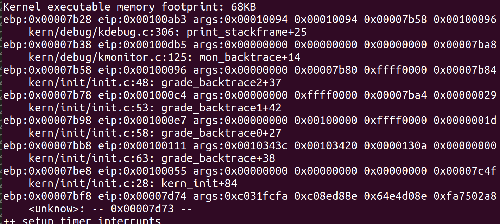

# ucore_lab1
刘昊鹏  201907040101  
- [练习1](#练习1)  
- [练习2](#练习2)  
- [练习3](#练习3)  
- [练习4](#练习4)  
- [练习5](#练习5)  
- [练习6](#练习6) 
- [扩展练习](#扩展练习) 
- [总结](#总结)

## 练习1  
> __理解通过make生成执行文件的过程。__   
>>列出本实验各练习中对应的OS原理的知识点，并说明本实验中的实现部分如何对应和体现了原理中的基本概念和关键知识点。   

对应的OS原理知识点以及如何与实现部分对应将在练习解答中列出。  

>>操作系统镜像文件ucore.img是如何一步一步生成的？(需要比较详细地解释Makefile中每一条相关命令和命令参数的含义，以及说明命令导致的结果)  

在Makefile中查找创建ucore.img的片段：
```Makefile
# create ucore.img
UCOREIMG	:= $(call totarget,ucore.img)
$(UCOREIMG): $(kernel) $(bootblock)
	$(V)dd if=/dev/zero of=$@ count=10000
	$(V)dd if=$(bootblock) of=$@ conv=notrunc
	$(V)dd if=$(kernel) of=$@ seek=1 conv=notrunc
$(call create_target,ucore.img)
```
包含dd命令，含义为用指定大小的块拷贝一个文件，```dd if=/dev/zero of=$@ count=10000```向ucore.img写入10000个512bytes的空字符。然后之后从bootblock文件中向ucore.img写入数据，接下来从kernel中向ucore.img写入块0。  
因此需要先生成bootblock和kernel。  
在Makefile中查找创建bootblock和kernel的片段：
```Makefile
# create bootblock
bootfiles = $(call listf_cc,boot)
$(foreach f,$(bootfiles),$(call cc_compile,$(f),$(CC),$(CFLAGS) -Os -nostdinc))
bootblock = $(call totarget,bootblock)
$(bootblock): $(call toobj,$(bootfiles)) | $(call totarget,sign)
	@echo + ld $@
	$(V)$(LD) $(LDFLAGS) -N -e start -Ttext 0x7C00 $^ -o $(call toobj,bootblock)
	@$(OBJDUMP) -S $(call objfile,bootblock) > $(call asmfile,bootblock)
	@$(OBJCOPY) -S -O binary $(call objfile,bootblock) $(call outfile,bootblock)
	@$(call totarget,sign) $(call outfile,bootblock) $(bootblock)
$(call create_target,bootblock)
-----------------------------------------------------------------------------------------------------------
# create kernel target
kernel = $(call totarget,kernel)
$(kernel): tools/kernel.ld
$(kernel): $(KOBJS)
	@echo + ld $@
	$(V)$(LD) $(LDFLAGS) -T tools/kernel.ld -o $@ $(KOBJS)
	@$(OBJDUMP) -S $@ > $(call asmfile,kernel)
	@$(OBJDUMP) -t $@ | $(SED) '1,/SYMBOL TABLE/d; s/ .* / /; /^$$/d' > $(call symfile,kernel)
$(call create_target,kernel)
```
这一部分有点复杂，先结合```make V=```指令，查看make执行了那些指令：
```shell
+ cc kern/init/init.c
	gcc -Ikern/init/ ... -c kern/init/init.c -o obj/kern/init/init.o
+ cc kern/libs/stdio.c
	以下全部省略具体gcc指令
+ cc kern/libs/readline.c
+ cc kern/debug/panic.c
+ cc kern/debug/kdebug.c
+ cc kern/debug/kmonitor.c
+ cc kern/driver/clock.c
+ cc kern/driver/console.c
+ cc kern/driver/picirq.c
+ cc kern/driver/intr.c
+ cc kern/trap/trap.c
+ cc kern/trap/vectors.S
+ cc kern/trap/trapentry.S
+ cc kern/mm/pmm.c
+ cc libs/string.c
+ cc libs/printfmt.c
```
```-I<dir>```表示添加搜索头文件的路径，以上命令将kern和libs文件夹中的.c文件和.S文件编译成.o文件，保存在obj文件夹下对应的目录中。gcc的`-nostdinc`参数让gcc不要到标准编译目录下寻找头文件，`-ggdb`用于提供使用gdb调试时需要的信息。
接下来
```shell
+ ld bin/kernel
	ld -m    elf_i386 -nostdlib -T tools/kernel.ld -o bin/kernel  obj/kern/init/init.o等上面生成的.o文件
+ cc boot/bootasm.S
	gcc -Iboot/ ... -c boot/bootasm.S -o obj/boot/bootasm.o
+ cc boot/bootmain.c
	gcc -Iboot/ ... -c boot/bootmain.c -o obj/boot/bootmain.o
+ cc tools/sign.c
	gcc -Itools/ -g -Wall -O2 -c tools/sign.c -o obj/sign/tools/sign.o
	gcc -g -Wall -O2 obj/sign/tools/sign.o -o bin/sign
+ ld bin/bootblock
	ld -m    elf_i386 -nostdlib -N -e start -Ttext 0x7C00 obj/boot/bootasm.o bootmain.o -o obj/bootblock.o
```
ld将上部分生成的部分.o文件链接编译程kernel。  
bootblock的生成结合Makefile中的内容理解：ld链接器将bootmain.o和bootasm.o链接为bootblock.o，-N表示把代码段和数据段都设置为可读而且可写的，-e表示自行设置程序入口，-Ttext指定入口地址为0x7C00，然后把obj/bootblock.o的源码和反汇编代码混合输出到bootblock.asm中，把bootblock.o的源码copy并且以二进制的形式（-O binary）translate到bootblock.out中，-S表示不copy重定向和符号信息。之后利用bin/sign程序依靠bootblock.out生成bootblock程序。  
  
总结ucore.img的生成过程
1. 编译libs和kern目录下所有的.c和.S文件，生成.o文件，并链接得到bin/kernel文件。
2. 编译boot目录下所有的.c和.S文件，生成.o文件，并链接翻译得到bin/bootblock.out文件。
3. 编译tools/sign.c文件，得到sign程序，用来生成虚拟的硬盘主引导扇区。
4. 利用sign工具将bin/bootblock.out文件转化为512字节的bin/bootblock文件，并将bin/bootblock的最后两个字节设置为0x55AA为bin/ucore.img分配5000MB的内存空间，并将bin/bootblock复制到bin/ucore.img的第一个block，紧接着将bin/kernel复制到ucore.img第二个block开始的位置。  

>>一个被系统认为是符合规范的硬盘主引导扇区的特征是什么？  

主引导扇区位于整个硬盘的0磁头0柱面1扇区，包括硬盘主引导记录MBR和分区表DPT。其中主引导记录的作用就是检查分区表是否正确以及确定哪个分区为引导分区，并在程序结束时把该分区的启动程序，也就是操作系统引导扇区调入内存加以执行。  
在总共512字节的MBR扇区中,引导程序共占用440字节,分区表占用64字节，是MBR中非常重要的一个结构。扇区最后两个字节```55AA```是MBR的结束标志。
查看sign.c文件：
```c
	if (st.st_size > 510) {
        fprintf(stderr, "%lld >> 510!!\n", (long long)st.st_size);
        return -1;
    }
```
```c
    buf[510] = 0x55;
    buf[511] = 0xAA;
```
可以看到bootblock必须不大于510字节，最后两个字节为```55AA```。

## 练习2
> __使用qemu执行并调试lab1中的软件。__  
>>为了熟悉使用qemu和gdb进行的调试工作，我们进行如下的小练习：
>> 1. 从CPU加电后执行的第一条指令开始，单步跟踪BIOS的执行。
>> 2. 在初始化位置0x7c00设置实地址断点,测试断点正常。
>> 3. 从0x7c00开始跟踪代码运行,将单步跟踪反汇编得到的代码与bootasm.S和 bootblock.asm进行比较。
>> 4. 自己找一个bootloader或内核中的代码位置，设置断点并进行测试。  

根据提示，跟据附录*“启动后第一条执行的指令”*的提示进行操作：  
首先修改lab1/tools/gdbinit为：
```shell
set architecture i8086  	
target remote :1234
```
该部分为进入gdb时执行的命令，第一行设置为i8086架构，第二行让gdb连接到qemu的端口。  
在lab1下执行```make debug```后弹出一个终端为gdb的界面，并停在0x0000fff0的位置，显示如下：
```shell
The target architecture is assumed to be i8086
0x0000fff0 in ?? ()
(gdb) x /2i 0x0000fff0
=> 0xfff0:      add    %al,(%eax)
   0xfff2:      add    %al,(%eax)
(gdb) si
0x0000e05b in ?? ()
(gdb) 
```
可以使用x/2i查看该位置的代码，接下来使用`si`可一步步执行指令。  
使用`b *0x7c00`将设置断点在初始化位置，然后`c`，在断点处成功停下，断点正常。
```shell
(gdb) b *0x7c00
Breakpoint 1 at 0x7c00
(gdb) c
Continuing.

Breakpoint 1, 0x00007c00 in ?? ()
(gdb) 
```
可以使用`x`查看从0x7c00开始的代码，由于代码比较长，使用以下gdb指令将代码输出到文本：
```shell
set logging file gg.txt
set logging on
```
得到反汇编的代码：
```
   0x7c00:	cli    
   0x7c01:	cld   
   0x7c02:	xor    %eax,%eax
   0x7c04:	mov    %eax,%ds
   0x7c06:	mov    %eax,%es
   0x7c08:	mov    %eax,%ss
   ...
```
查看bootasm.S的代码：
```x86asm
	cli                                             # Disable interrupts
    cld                                             # String operations increment
    # Set up the important data segment registers (DS, ES, SS).
    xorw %ax, %ax                                   # Segment number zero
    movw %ax, %ds                                   # -> Data Segment
    movw %ax, %es                                   # -> Extra Segment
    movw %ax, %ss                                   # -> Stack Segment
    ...
```
查看bootasm.asm的代码
```x86asm
	cli                                             # Disable interrupts
    7c00:	fa                   	cli    
    cld                                             # String operations increment
    7c01:	fc                   	cld    
    # Set up the important data segment registers (DS, ES, SS).
    xorw %ax, %ax                                   # Segment number zero
    7c02:	31 c0                	xor    %eax,%eax
    movw %ax, %ds                                   # -> Data Segment
    7c04:	8e d8                	mov    %eax,%ds
    movw %ax, %es                                   # -> Extra Segment
    7c06:	8e c0                	mov    %eax,%es
    movw %ax, %ss                                   # -> Stack Segment
    7c08:	8e d0                	mov    %eax,%ss
    ...
```
对比发现三个文本的指令是相同的，只是形式不一样。  
自己找一个bootloader或内核中的代码位置，设置断点并进行测试：
```shell
	(gdb) b *0x7c40
	Breakpoint 1 at 0x7c40
	(gdb) c
	Continuing.

	Breakpoint 1, 0x00007c40 in ?? ()
	(gdb) 
```
测试成功！  
## 练习3
>__分析bootloader进入保护模式的过程。__  
>>BIOS将通过读取硬盘主引导扇区到内存，并转跳到对应内存中的位置执行bootloader。请分析bootloader是如何完成从实模式进入保护模式的。  
  
根据提示，bootloader从实模式切换到保护模式，需要经过以下过程：  
>1. 为何开启A20，以及如何开启A20
>2. 如何初始化GDT表
>3. 如何使能和进入保护模式
  
根据提示，首先要开启A20。为何开启A20:  
在Intel 8086/8088处理器中，有20根地址总线，故能够寻址1MB的地址空间，访问奇数M的内存，为了更多的内存，需要第20根总线A20，A20地址线并不是打开保护模式的关键，只是在保护模式下，不打开A20地址线，将无法访问到所有的内存。  
bootasm.S中的注释给出了以下解释：  
>For backwards compatibility with the earliest PCs, physical address line 20 is tied low, so that addresses higher than 1MB wrap around to zero by default. This code undoes this.  

__如何开启A20？__ 根据代码：  
1. 等待8042空闲
```x86asm
seta20.1:
    inb $0x64, %al               	#取8042的状态 Wait for not busy(8042 input buffer empty).
    testb $0x2, %al 				 #0x2:芯片初始系统状态
    jnz seta20.1 					#循环
```
2. 向端口0x64发送写命令
```
	movb $0xd1, %al					# 0xd1 -> port 0x64
    outb %al, $0x64					# 0xd1 means: write data to 8042's P2 port
```
3. 再次等待8042空闲，代码同1
4. 向端口0x60写入数据  
```
	movb $0xdf, %al                	# 0xdf -> port 0x60
    outb %al, $0x60             	   # 0xdf = 11011111, means set P2's A20 bit(the 1 bit) to 1
```

__接下来需要初始化GDT表：__  
GDT全局描述符表是一个保存多个段描述符的“数组”，其初始化的代码如下：
```
# Bootstrap GDT
.p2align 2										 # force 4 byte alignment
gdt:
    SEG_NULLASM									# null seg
    SEG_ASM(STA_X|STA_R, 0x0, 0xffffffff)		  # code seg for bootloader and kernel
    SEG_ASM(STA_W, 0x0, 0xffffffff)				# data seg for bootloader and kernel

gdtdesc:
    .word 0x17				# sizeof(gdt) - 1
    .long gdt				 # address gdt
```
根据描述，共24字节，分三段，每段8字节。第一段设置为空。第二段为代码段，第三段为数据段。它们的base都设置为0，limit都设置为0xffffff，长度均为4G。代码段设置为可读和可执行权限，数据段设置为可写权限。  
__最后切换到保护模式:__   
x86的CR0寄存器的第0位(PE)控制模式，如果PE位置1，则保护模式启动，如果PE=0，则在实模式下运行。
```
    movl %cr0, %eax				#取CR0当前状态
    orl $CR0_PE_ON, %eax	  	 #CR0_PE_ON=0x1,异或设置第0位位1
    movl %eax, %cr0				#赋给CRO
```
至此bootloader完成从实模式进入保护模式的。  
## 练习4
>__分析bootloader加载ELF格式的OS的过程。__  
>>通过阅读bootmain.c，了解bootloader如何加载ELF文件。通过分析源代码和通过qemu来运行并调试bootloader&OS，
>>1. bootloader如何读取硬盘扇区的？
>>2. bootloader是如何加载ELF格式的OS？  

__bootloader如何读取硬盘扇区__  
通过查阅资料，了解到的BootLoader读取扇区的流程如下：
1. 等待磁盘准备好；
2. 发出读取扇区的命令；
3. 等待磁盘准备好；
4. 把磁盘扇区数据读到指定内存。  

等待磁盘准备好的代码如下，寄存器是0x1F7，如果它的最高2位是01表示磁盘准备好，通过循环实现。
```C
static void
waitdisk(void) {
    while ((inb(0x1F7) & 0xC0) != 0x40)
        /* do nothing */;
}
```
读取硬盘扇区的过程见代码和注释：
```c
/* readsect - read a single sector at @secno into @dst */
static void
readsect(void *dst, uint32_t secno) {
    // wait for disk to be ready
    waitdisk();

    outb(0x1F2, 1);                   	// count = 1 扇区数
    outb(0x1F3, secno & 0xFF);			//读取的扇区起始编号共28位，分成4部分依次放在0x1F3~0x1F6寄存器中。
    outb(0x1F4, (secno >> 8) & 0xFF);
    outb(0x1F5, (secno >> 16) & 0xFF);
    outb(0x1F6, ((secno >> 24) & 0xF) | 0xE0);
    outb(0x1F7, 0x20);               	//发出读取扇区的命令

    // wait for disk to be ready
    waitdisk();

    // read a sector
    insl(0x1F0, dst, SECTSIZE / 4);//以4字节为单位读取数据
}
```
readsect函数只能读取4字节的数据，将其包装成readseg可读取任意长度的数据：
```c
static void
readseg(uintptr_t va, uint32_t count, uint32_t offset) {
    uintptr_t end_va = va + count;
    // round down to sector boundary
    va -= offset % SECTSIZE;
    // translate from bytes to sectors; kernel starts at sector 1
    uint32_t secno = (offset / SECTSIZE) + 1;
    for (; va < end_va; va += SECTSIZE, secno ++) {
        readsect((void *)va, secno);
    }
}
```
__bootloader是如何加载ELF格式的OS__  

bootloader加载的ELF文件是kernel  
结合代码分析：
```C
#define ELFHDR          ((struct elfhdr *)0x10000)      // scratch space
void
bootmain(void) {
    // read the 1st page off disk
    readseg((uintptr_t)ELFHDR, SECTSIZE * 8, 0);
    //读取第一页到0x10000的位置
    // is this a valid ELF?
    if (ELFHDR->e_magic != ELF_MAGIC) {
        goto bad;
    }
    //校验ELF Header的e_magic字段，以确保这是一个ELF文件
    struct proghdr *ph, *eph;

    // load each program segment (ignores ph flags)
    ph = (struct proghdr *)((uintptr_t)ELFHDR + ELFHDR->e_phoff);//program header 表的位置偏移
    eph = ph + ELFHDR->e_phnum;
    for (; ph < eph; ph ++) {
        readseg(ph->p_va & 0xFFFFFF, ph->p_memsz, ph->p_offset);
    }//从磁盘加载到内存

    // call the entry point from the ELF header
    // note: does not return
    ((void (*)(void))(ELFHDR->e_entry & 0xFFFFFF))();
    //根据ELF头部储存的入口信息，找到内核的入口

bad:
    outw(0x8A00, 0x8A00);
    outw(0x8A00, 0x8E00);

    /* do nothing */
    while (1);
}
```
总结一下就是先将ELF文件的header信息读取到内存，然后根据ELF header的信息判断文件是否合法，然后得到Program Header表，遍历Program Header表中的每个元素，得到每个Segment在文件中的偏移、要加载到内存中的位置（虚拟地址）及Segment的长度等信息，并通过磁盘I/O进行加载，加载完毕后通过e_entry得到内核的入口地址，并跳转到该地址开始执行内核代码。  
ELF header和Program Header的部分信息如下：  
```C
#define ELF_MAGIC    0x464C457FU            // "\x7FELF" in little endian

struct elfhdr {
  uint magic;  // must equal ELF_MAGIC
  uint entry;  // 程序入口的虚拟地址
  uint phoff;  // program header 表的位置偏移
  ushort phnum; //program header表中的入口数目
  ...
};
struct proghdr {
  uint type;   // 段类型
  uint offset;  // 段相对文件头的偏移值
  uint va;     // 段的第一个字节将被放到内存中的虚拟地址
  uint memsz;  // 段在内存映像中占用的字节数
  ...
};
```
## 练习5
>__实现函数调用堆栈跟踪函数__  
>>我们需要在lab1中完成kdebug.c中函数print_stackframe的实现，可以通过函数print_stackframe来跟踪函数调用堆栈中记录的返回地址。  
  
本题需要在执行make qemu时打印出寄存器ebp,eip的信息和参数的信息，在代码的注释中给出获取栈帧信息的函数和获取参数值的方法。下面分析一下原理。  
<div align="center">

</div>

根据函数调用栈的规则，参数从ebp+2开始，ebp+1为下一条指令即返回地址的指令即新的eip的值。调用该函数的指令在返回的位置的上面，即eip-1。代码如下：
```c
    uint32_t ebp = read_ebp();//get the value of ebp
    uint32_t eip = read_eip();
    uint32_t *arg;
    int i,j;
    for(i = 0; i<STACKFRAME_DEPTH && ebp!=0; i++)
    {
        cprintf("ebp:0x%08x eip:0x%08x args:", ebp, eip);//输出ebp和eip
        arg = (uint32_t *)ebp + 2;         //参数的首地址
        for(j=0; j<4; j++)
            cprintf("0x%08x ", arg[j]);    //输出每一参数     
        cprintf("\n");
        print_debuginfo(eip-1);              //print the C calling function name
        eip = ((uint32_t *)ebp)[1];          //eip更新为返回地址
        ebp = ((uint32_t *)ebp)[0];          //ebp寄存器存放的是调用者的ebp寄存器的值
        //！！一定要先更新eip，否则ebp会改变
    }
```
执行make qemu后结果如图：
<div align="center">

</div>
除具体数值外与要求一致。    

解释最后一行：

```
ebp:0x00007bf8 eip:0x00007d74 args:0xc031fcfa 0xc08ed88e 0x64e4d08e 0xfa7502a8
```
ebp的值应该kern_init的栈顶地址，eip的值是调用kern_init函数后的返回地址。调用他的函数就是从ELF读取加载的Kern中的函数。
```
	((void (*)(void))(ELFHDR->e_entry & 0xFFFFFF))();
    7d68:	a1 18 00 01 00       	mov    0x10018,%eax
    7d6d:	25 ff ff ff 00       	and    $0xffffff,%eax
    7d72:	ff d0                	call   *%eax
    #返回地址
	7d74:	ba 00 8a ff ff       	mov    $0xffff8a00,%edx
```
args应该是函数的参数，但是kern_init没有参数。而print_stackframe函数将ebp+1到ebp+5的四个字节当作参数输出。ebp是调用kern_init的栈顶，所以四个参数应该是调用kern_init处前面的16个字节的指令，根据ebp：7bf8计算起始地址为7c00，在bootblock.asm找到代码：
```
	cli                                             # Disable interrupts
    7c00:	fa                   	cli    
    cld                                             # String operations increment
    7c01:	fc                   	cld    

    # Set up the important data segment registers (DS, ES, SS).
    xorw %ax, %ax                                   # Segment number zero
    7c02:	31 c0                	xor    %eax,%eax
    movw %ax, %ds                                   # -> Data Segment
    7c04:	8e d8                	mov    %eax,%ds
    movw %ax, %es                                   # -> Extra Segment
    7c06:	8e c0                	mov    %eax,%es
    movw %ax, %ss                                   # -> Stack Segment
    7c08:	8e d0                	mov    %eax,%ss
```
## 练习6
>__完善中断初始化和处理__  

__中断描述符表（也可简称为保护模式下的中断向量表）中一个表项占多少字节？其中哪几位代表中断处理代码的入口？__  
操作系统是由中断驱动的，用于当某事件发生时，可以主动通知cpu及os进行处理，主要的中断类型有外部中断、内部中断（异常）、软中断（陷阱、系统调用）。
查看/kern/mm/mmu.h中的结构体：
```C
/* Gate descriptors for interrupts and traps */
struct gatedesc {
    unsigned gd_off_15_0 : 16;        // low 16 bits of offset in segment
    unsigned gd_ss : 16;            // segment selector
    unsigned gd_args : 5;            // # args, 0 for interrupt/trap gates
    unsigned gd_rsv1 : 3;            // reserved(should be zero I guess)
    unsigned gd_type : 4;            // type(STS_{TG,IG32,TG32})
    unsigned gd_s : 1;                // must be 0 (system)
    unsigned gd_dpl : 2;            // descriptor(meaning new) privilege level
    unsigned gd_p : 1;                // Present
    unsigned gd_off_31_16 : 16;        // high bits of offset in segment
};
```
虽然不知道这是什么语法，但是`“:”`后面应该是数据类型大小，所以表项加起来大小为:`16+16+5+3+4+1+2+1+16=64=8bits`，即8字节。  
<div align="center">

</div>
表项的第二个成员gd_ss为段选择子，第一个成员gd_off_15_0和最后一个成员gd_off_31_16共同组成一个段内偏移地址。根据段选择子和段内偏移地址就可以得出中断处理程序的入口。
  
__请编程完善kern/trap/trap.c中对中断向量表进行初始化的函数idt\_init。__ 在idt_init函数中，依次对所有中断入口进行初始化。使用mmu.h中的SETGATE宏，填充idt数组内容。每个中断的入口由tools/vectors.c生成，使用trap.c中声明的vectors数组即可。
编程如下：
```c
    // __vectors定义于vector.S中
    extern uintptr_t __vectors[];
    int i;
    for (i = 0; i < sizeof(idt) / sizeof(struct gatedesc); i ++)
      // 目标idt项为idt[i]
      // 该idt项为内核代码，所以使用GD_KTEXT段选择子
      // 中断处理程序的入口地址存放于__vectors[i]
      // 特权级为DPL_KERNEL
      SETGATE(idt[i], 0, GD_KTEXT, __vectors[i], DPL_KERNEL);
    // 设置从用户态转为内核态的中断的特权级为DPL_USER
    SETGATE(idt[T_SWITCH_TOK], 0, GD_KTEXT, __vectors[T_SWITCH_TOK], DPL_USER);
    // 加载该IDT
    lidt(&idt_pd);
```
其中SETGATE函数的描述如下：
```C
/* *
 * Set up a normal interrupt/trap gate descriptor
 *   - istrap: 1 for a trap (= exception) gate, 0 for an interrupt gate
 *   - sel: Code segment selector for interrupt/trap handler
 *   - off: Offset in code segment for interrupt/trap handler
 *   - dpl: Descriptor Privilege Level - the privilege level required
 *          for software to invoke this interrupt/trap gate explicitly
 *          using an int instruction.
 *	DPL存储于段描述符中，规定访问该段的权限级别(Descriptor Privilege Level)，每个段的DPL固定。当进程访问一个段时，需要进程特权级检查。
 *	CPL存在于CS寄存器的低两位，即CPL是CS段描述符的DPL，是当前代码的权限级别。
 * */
 #define SETGATE(gate, istrap, sel, off, dpl)
```
与参考答案中的代码一样。  

__请编程完善trap.c中的中断处理函数trap__ ，在对时钟中断进行处理的部分填写trap函数中处理时钟中断的部分，使操作系统每遇到100次时钟中断后，调用print_ticks子程序，向屏幕上打印一行文字”100 ticks”。 
编程如下： 
```C
	case IRQ_OFFSET + IRQ_TIMER:
        ticks++;
        if(ticks % TICK_NUM == 0)
            print_ticks();
        break;
```
执行make qemu查看  
<div align="center">

</div>

## 扩展练习 
### Challenge 1
>扩展proj4,增加syscall功能，即增加一用户态函数（可执行一特定系统调用：获得时钟计数值），当内核初始完毕后，可从内核态返回到用户态的函数，而用户态的函数又通过系统调用得到内核态的服务。  

__从内核态切换到用户态__    
从内核态切换到用户态分成两个部分：引发中断和中断处理。  
引发中断，即字面意思，引发一个从内核态切换到用户态的中断，然后让中断处理程序来切换特权级。  
首先取消掉kern_init()中lab1_switch_test();的注释，然后补充lab1_switch_to_user：
```c
static void lab1_switch_to_user(void) {
    //LAB1 CHALLENGE 1 : TODO
    asm volatile (
        "pushl %%ss \n"
        "pushl %%esp \n"
        "int %0 \n"
        "movl %%ebp, %%esp"
        : 
        : "i"(T_SWITCH_TOU)
    );
}
```
插入汇编代码引发T_SWITCH_TOU中断。`sub $0x8, %%esp`预留用户栈ss、esp的空间，`int $T_SWITCH_TOU`进入相应中断完成内核态到用户态转换的过程，`movl %%ebp, %%esp`为转换到用户态后将lab1_switch_to_user函数处于刚进入函数执行的状态（esp = ebp）。  
然后处理中断，主要的过程是将cs设为用户代码段，ds、es、ss数据段设为用户数据段，用户栈的esp仍设为中断时使用的栈，在中断返回时会自动弹出esp、ss用于恢复到用户栈。
```c
	case T_SWITCH_TOU:
        if (tf->tf_cs != USER_CS) 
        {
            tf->tf_cs = USER_CS;
            tf->tf_ds = tf->tf_es = tf->tf_ss = USER_DS;
            tf->tf_eflags |= FL_IOPL_MASK;
        }
        break;
```
因为仅仅是在运行初始对切换状态进行测试，所以这里并没有保存切换前的状态。  
__从用户态切换到内核态__   
引发中断：  
```C
static void lab1_switch_to_kernel(void) {
    //LAB1 CHALLENGE 1 :  TODO
    asm volatile (
        "int %0 \n"
        "movl %%ebp, %%esp \n"
        : 
        : "i"(T_SWITCH_TOK)
    );
}
```
用户态切换为内核态相当于内核态的中断处理程序返回为内核态的过程。在练习6中，已经单独初始化T_SWITCH_TOK中断的特权级为用户级，所以可以在用户态执行T_SWITCH_TOK中断处理程序，让它返回内核态。  
```
SETGATE(idt[T_SWITCH_TOK], 0, GD_KTEXT, __vectors[T_SWITCH_TOK], DPL_USER);
```
处理中断：
```C
    case T_SWITCH_TOK:
        if (tf->tf_cs != KERNEL_CS) 
        {
            tf->tf_cs = KERNEL_CS;
            tf->tf_ds = tf->tf_es = KERNEL_DS;
            tf->tf_eflags &= ~FL_IOPL_MASK;
        }
        break;
```
测试结果：  
<div align="center">

</div>

### Challenge 2
>__用键盘实现用户模式内核模式切换。__ 具体目标是：“键盘输入3时切换到用户模式，键盘输入0时切换到内核模式”。   

按键会触发IRQ_OFFSET + IRQ_KBD中断，因为在challenge 1中没有对切换的代码进行包装，所以将代码在中断处理程序里重新写一遍，并在下面介绍补充的地方。在中断处理处添加如下代码：

```c
struct trapframe switchk2u, *switchu2k;

    case IRQ_OFFSET + IRQ_KBD:
        c = cons_getc();
        cprintf("kbd [%03d] %c\n", c, c);
        if(c == '0')
        {
            if (tf->tf_cs != KERNEL_CS) {
                cprintf("+++ switch to  kernel  mode +++\n");
                tf->tf_cs = KERNEL_CS;
                tf->tf_ds = tf->tf_es = KERNEL_DS;
                tf->tf_eflags &= ~FL_IOPL_MASK;
                switchu2k = (struct trapframe *)(tf->tf_esp - (sizeof(struct trapframe) - 8));
                memmove(switchu2k, tf, sizeof(struct trapframe) - 8);
                *((uint32_t *)tf - 1) = (uint32_t)switchu2k;
            }
        }
        else if(c == '3')
        {
              if (tf->tf_cs != USER_CS) {
                cprintf("+++ switch to  user  mode +++\n");
                switchk2u = *tf;
                switchk2u.tf_cs = USER_CS;
                switchk2u.tf_ds = switchk2u.tf_es = switchk2u.tf_ss = USER_DS;
                switchk2u.tf_esp = (uint32_t)tf + sizeof(struct trapframe) - 8;
                switchk2u.tf_eflags |= FL_IOPL_MASK;
                *((uint32_t *)tf - 1) = (uint32_t)&switchk2u;
            }
        }
        break;
```
与challenge 1不同之处为，因为需要在运行过程中随时切换，我们要保存内核态和用户态的除cs等寄存器外的其它信息。定义两个trapframe全局变量用于在切换前保存状态，切换时只改变cs等信息。  

测试结果：  
<div align="center">

</div>

`make grade`查看分数：
<div align="center">

</div>

## 总结

实验难度很大，从练习一的makefile开始，虽然之前的实验有在用但是不清楚原理，所以练习一花费了很长时间。后面的练习理论与实际相结合，学到了在课上没有的A20，GDT等。    
实验的内容很多，通过搜索一个个不懂的概念能学到非常多的东西。因为搞不懂某个概念就搞不懂这个实验，所以通过实验学习比自发学习要更有动力。   
实验的工作量很大，以后每周一个有点吃不消，但一定能完成。