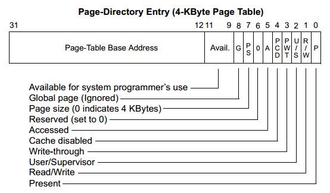
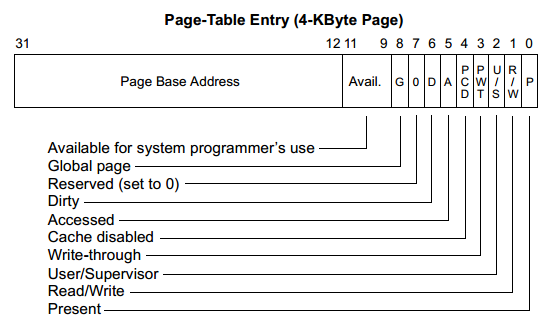
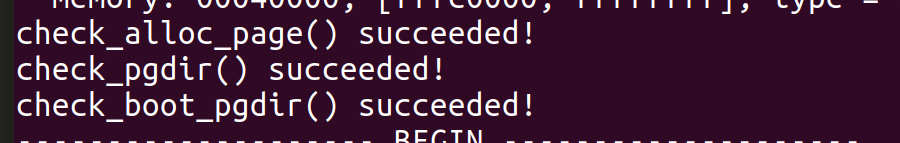
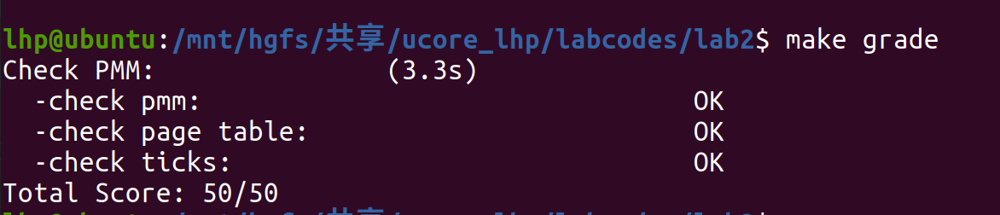
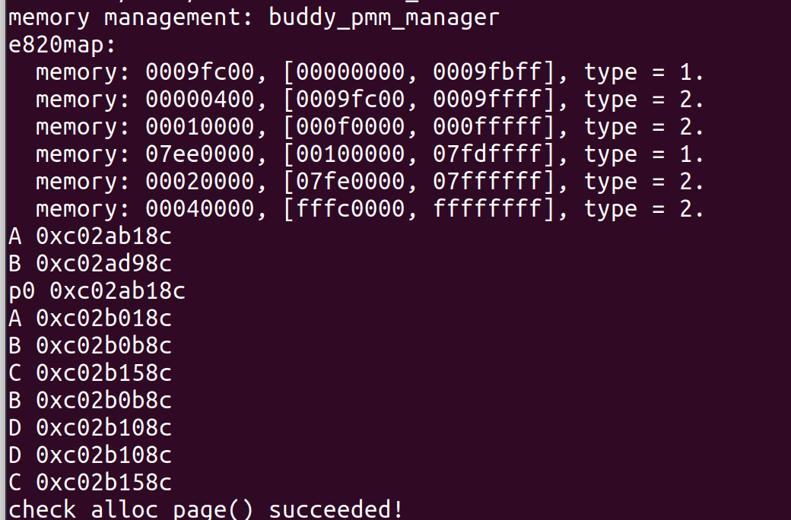

# ucore_lab2
201907040101  刘昊鹏  

- [练习0](#练习0)
- [练习1](#练习1)  
- [练习2](#练习2)  
- [练习3](#练习3)  
- [扩展练习](#扩展练习) 
- [总结](#总结)
    - [知识点](#知识点)

## 练习0
>__填写已有实验__  
>>本实验依赖实验1。请把你做的实验1的代码填入本实验中代码中有“LAB1”的注释相应部分。提示：可采用diff和patch工具进行半自动的合并（merge），也可用一些图形化的比较/merge工具来手动合并，比如meld，eclipse中的diff/merge工具，understand中的diff/merge工具等。  


Linux中使用以下指令可进行比较合并：
```shell
lhp@ubuntu:/mnt/hgfs/共享/ucore_lhp/labcodes$ diff -ruN lab1 lab2 > patch.log
lhp@ubuntu:/mnt/hgfs/共享/ucore_lhp/labcodes$ cp patch.log lab2
lhp@ubuntu:/mnt/hgfs/共享/ucore_lhp/labcodes$ cd lab2
lhp@ubuntu:/mnt/hgfs/共享/ucore_lhp/labcodes/lab2$ patch -p1 <patch.log
```
## 练习1
>__实现 first-fit 连续物理内存分配算法（需要编程）__  
>>在实现first fit内存分配算法的回收函数时，要考虑地址连续的空闲块之间的合并操作。提示:在建立空闲页块链表时，需要按照空闲页块起始地址来排序，形成一个有序的链表。可能会修改default_pmm.c中的default_init，default_init_memmap，default_alloc_pages，default_free_pages等相关函数。请仔细查看和理解default_pmm.c中的注释。  

根据要求——在建立空闲页块链表时，需要按照空闲页块起始地址来排序，形成一个有序的链表。在插入新空闲页块时，要把新块插入到当前节点得前面。  
插入的代码如下：  
```C
static void
default_init_memmap(struct Page *base, size_t n) {
    assert(n > 0);
    struct Page *p = base;
    for (; p != base + n; p ++) {
        assert(PageReserved(p));
        p->flags = p->property = 0;
        set_page_ref(p, 0);
    }
    base->property = n;
    SetPageProperty(base);
    nr_free += n;
    list_add(&free_list, &(base->page_link));
}
```
由`list_add`将找到的新块插入到空闲内存链表free_list中，根据查看list.h中的代码，`list_add(list_entry_t *listelm, list_entry_t *elm)`将elm插入到链表listelm的后面，不符合要求，因此需要修改。list.h中提供了list_add_before函数，将elm插入到listelm前面，因此可以使用这个函数，修改后如下：
```C
static void
default_init_memmap(struct Page *base, size_t n) {
    assert(n > 0);
    struct Page *p = base;
    for (; p != base + n; p ++) {
        assert(PageReserved(p));
        p->flags = p->property = 0;
        set_page_ref(p, 0);
    }
    base->property = n;
    SetPageProperty(base);
    nr_free += n;
    list_add_before(&free_list, &(base->page_link));
}
```
接下来是使用first-fit算法分配内存页，实现函数为default_alloc_pages(size_t n)，返回符合要求的页指针。first fit算法从空闲分区链首开始查找，直至找到一个能满足其大小要求的空闲分区为止。然后再按照作业的大小，从该分区中划出一块内存分配给请求者，余下的空闲分区仍留在空闲分区链中。  
在函数default_alloc_pages已经实现寻找满足大小的空闲块并分配，但是将剩余块插入到链表的操作不符合要求。  
```C
	if (page != NULL) {
        list_del(&(page->page_link));
        if (page->property > n) {
            struct Page *p = page + n;
            p->property = page->property - n;
            list_add(&free_list, &(p->page_link));
    	}
    	nr_free -= n;
        ClearPageProperty(page);
    }
```
在插入分配后剩余的块时，没有按照内存地址从大到小的顺序，可以借助list_add_before或list_add_after函数将新节点插入到链表中与原来的节点前后，然后再把原来的节点移除，另外，对于新建的节点，要设置它的flags，通过函数SetPageProperty实现，修改后的代码如下：  
```C
    if (page != NULL) {
        if (page->property > n) {
            struct Page *p = page + n;
            p->property = page->property - n;
            SetPageProperty(p);//设置flags
            list_add_before(&(page->page_link), &(p->page_link));//插入到原节点的前面
        }
        list_del(&(page->page_link));//移除分配的节点
        nr_free -= n;
        ClearPageProperty(page);
    }
```
default_free_pages函数的作用是释放使用完毕的内存，并将空闲的内存页插入到链表。插入时需要分情况讨论，需考虑到释放的空间与链表中的空闲页是否连续，连续的需要合并。实验已经预置该部分的代码，但同样存在插入时没按地址顺序插入的问题。因此我们需要在链表中找到合适的位置再插入，代码如下：
```C
    le = list_next(&free_list);
    // 遍历找到插入的位置
    while (le != &free_list) {
        p = le2page(le, page_link);
        if (base + base->property <= p) {
            break;
        }
        le = list_next(le);
    }
    list_add_before(le, &(base->page_link));//将空闲块插找到的位置前面
```
>>你的first fit算法是否有进一步的改进空间  

有。  
在释放内存的代码中，是通过遍历找到插入剩余内存块在链表中的位置，时间复制度为`O(n)`，在剩余空间块存在与链表中某个内存块连续的情况下，可以将该内存块直接并入连续的节点中，即只需要更新链表中某节点值，时间为常数。
## 练习2
>__实现寻找虚拟地址对应的页表项（需要编程）__    
>>通过设置页表和对应的页表项，可建立虚拟内存地址和物理内存地址的对应关系。其中的get_pte函数是设置页表项环节中的一个重要步骤。此函数找到一个虚地址对应的二级页表项的内核虚地址，如果此二级页表项不存在，则分配一个包含此项的二级页表。本练习需要补全get_pte函数 in kern/mm/pmm.c，实现其功能。  

根据注释，get_pte作用如下：
```C
//get_pte - get pte and return the kernel virtual address of this pte for la
//        - if the PT contians this pte didn't exist, alloc a page for PT
// parameter:
//  pgdir:  the kernel virtual base address of PDT
//  la:     the linear address need to map
//  create: a logical value to decide if alloc a page for PT
// return vaule: the kernel virtual address of this pte
pte_t *
get_pte(pde_t *pgdir, uintptr_t la, bool create) 
```
本函数需要根据PDT和线性地址找到二级页面的位置，如果页面不存在，需要为其在页表上分配。 下图为*段页式管理总体框架图*:  
<div align="center">

</div>

线性地址都构成如下：
```C
// +--------10------+-------10-------+---------12----------+
// | Page Directory |   Page Table   | Offset within Page  |
// |      Index     |     Index      |                     |
// +----------------+----------------+---------------------+
//  \--- PDX(la) --/ \--- PTX(la) --/ \---- PGOFF(la) ----/
//  \----------- PPN(la) -----------/
```
通过线性地址中的PDIndex和PDT获得页目录的物理地址，即`&pgdir[PDX(la)]`，由于*ucore 的页式管理通过一个二级的页表实现。一级页表的起始物理地址存放在 cr3 寄存器中，这个地址必须是一个页对齐的地址，也就是低 12 位必须为 0。*所以将其将低12为置为0，实验提供了如下宏定义的方法：
```C
// address in page table or page directory entry
#define PTE_ADDR(pte)   ((uintptr_t)(pte) & ~0xFFF)
#define PDE_ADDR(pde)   PTE_ADDR(pde)
```
使用PDE_ADDR(pde)转换得到二级页表的地址，根据get_pte的注释中的信息，需要使用KADDR将物理地址转换为对应的虚拟地址。然后在通过线性地址中的PTE的偏移量PTX(la)得到二页页表条目。即`&((pte_t *)KADDR(PDE_ADDR(*pdep)))[PTX(la)]`。   
还需要考虑页面不存在的情况，需要为其在分配，代码如下：
```C
pte_t * get_pte(pde_t *pgdir, uintptr_t la, bool create) 
{
    //获取页目录的物理地址
    pde_t *pdep = &pgdir[PDX(la)];
    //如果该条目不可用(not present)
    if (!(*pdep & PTE_P)) 
    {
        struct Page *page;
        //如果分配页面失败，或者不允许分配
        if (!create || (page = alloc_page()) == NULL)
            return NULL;
        //设置该物理页面的引用次数为1
        set_page_ref(page, 1);
        //获取当前物理页面所管理的物理地址
        uintptr_t pa = page2pa(page);
        //清空该物理页面的数据。需要注意的是使用虚拟地址
        memset(KADDR(pa), 0, PGSIZE);
        //将新分配的页面设置为当前缺失的页目录条目中
        *pdep = pa | PTE_U | PTE_W | PTE_P;
        /*
         *   PTE_P           0x001              // page table/directory entry flags bit : Present
         *   PTE_W           0x002              // page table/directory entry flags bit : Writeable
         *   PTE_U           0x004              // page table/directory entry flags bit : User can access
         */
    }
    //返回二级页表项
    return &((pte_t *)KADDR(PDE_ADDR(*pdep)))[PTX(la)];
}
```

>>请描述页目录项（Page Directory Entry）和页表项（Page Table Entry）中每个组成部分的含义以及对ucore而言的潜在用处。  

根据教材描述，*PDE（至少）拥有有效位（valid bit）和页帧号（page frame number，PFN）。*其详细构成如下图：
<div align="center">

</div>

PTE的详细构成如下：
<div align="center">

</div>

其含义如下：
- Present: 表示当前PTE所指向的物理页面是否驻留在内存中
- Read/Write: 表示是否允许读写
- User/Sup: 表示该页的访问所需要的特权级。即User(ring 3)是否允许访问
- Write-though: 表示是否使用write through缓存写策略
- Cache disable: 表示是否不对该页进行缓存
- Accessed: 表示该页是否已被访问过
- Dirty: 表示该页是否已被修改
- Page size: 表示该页的大小
- Reserved: 该位必须保留为0
- Available: 第9-11这三位并没有被内核或中断所使用，可保留给OS使用。  

在ucore中，根据PDE索引PT时，只用到前20位，所以低12位可以根据需求设置标志位。
>>如果ucore执行过程中访问内存，出现了页访问异常，请问硬件要做哪些事情？  

硬件将引发页访问异常的地址将被保存在cr2寄存器中，设置错误代码，引发页中断(Page fault)，将外存的数据切换到内存中，处理完成后退出中断，返回到中断前的状态。

## 练习3
>__释放某虚地址所在的页并取消对应二级页表项的映射（需要编程）__  
>>当释放一个包含某虚地址的物理内存页时，需要让对应此物理内存页的管理数据结构Page做相关的清除处理，使得此物理内存页成为空闲；另外还需把表示虚地址与物理地址对应关系的二级页表项清除。请仔细查看和理解page_remove_pte函数中的注释。为此，需要补全在 kern/mm/pmm.c中的page_remove_pte函数。

根据注释的提示，实现该函数有如下步骤：
```C
    //(1) 检查页表条目是否可用
    //(2) 找到PTE对应的地址，使用page2pa
    //(3) 页面引用次数减一，使用page_ref_dec(page)
    //(4) 如果引用次数变为0，释放该页and free this page when page reference reachs 0
    //(5) 清除二级页表条目
    //(6) 刷新TLB，使用tlb_invalidate
```
编写代码如下：
```C
    //传入的页表条目是否可用
    if (*ptep & PTE_P) 
    {
        //获取页面所对应的地址
        struct Page *page = pte2page(*ptep);
        //如果该页的引用次数在减1后为0，释放当前页
        if (page_ref_dec(page) == 0)
            free_page(page);
        //清除二级页表条目
        *ptep = 0;
        //刷新TLB
        tlb_invalidate(pgdir, la);
    }
```
验证：
<div align="center">


</div>

>>数据结构Page的全局变量（其实是一个数组）的每一项与页表中的页目录项和页表项有无对应关系？如果有，其对应关系是啥？  

有。  
页目录项PDE储存着二级页表的基址，与线性地址中的PDIndex结合可以得到二级页表项的物理地址，即PTE的物理地址。  
页表项PTE储存着物理页的基址，与线性地址中的PTIndex结合得到实际物理页的物理地址。
>>如果希望虚拟地址与物理地址相等，则需要如何修改lab2，完成此事？ 鼓励通过编程来具体完成这个问题  

在page_init中，有一行：
```C
    struct e820map *memmap = (struct e820map *)(0x8000 + KERNBASE);
```
位物理地址与虚拟地址之间的映射，偏移量即是`KERNBASE`，其值为：
```
#define KERNBASE            0xC0000000
```
将其修改为0，表示物理地址与虚拟地址之间偏移量为0，虚拟地址便与物理地址相等。

## 扩展练习
>__buddy system（伙伴系统）分配算法（需要编程）__  
>>Buddy System算法把系统中的可用存储空间划分为存储块(Block)来进行管理, 每个存储块的大小必须是2的n次幂(Pow(2, n)), 即1, 2, 4, 8, 16, 32, 64, 128...  

基于实验说明提供的链接：[伙伴分配器的一个极简实现](https://coolshell.cn/articles/10427.html)实现

仿照pmm.h编写buddy.h文件
```C
#ifndef __KERN_MM_BUDDY_PMM_H__
#define  __KERN_MM_BUDDY_PMM_H__
#include <pmm.h>
extern const struct pmm_manager buddy_pmm_manager;
#endif
```
编写代码，完成buddy system（伙伴系统）分配算法，完整的代码在buddy.c中。  
实现思路：  
通过一个数组形式的完全二叉树来监控管理内存，二叉树的节点用于标记相应内存块的使用状态，高层节点对应大的块，低层节点对应小的块，在分配和释放中我们就通过这些节点的标记属性来进行块的分离合并。  
分配器的数据结构如下：
```c
struct buddy2 {
    unsigned size;//管理内存的总单元数目
    unsigned longest; //节点所对应的的内存块大小
};
```
按照练习1的步骤，依次进行二叉树的初始化，内存映射关系初始化，内存分配和释放。  
初始化的工作为给节点对应的内存块大小，代码如下：
```C
void buddy2_new(int size) {
    unsigned node_size;
    int i;
    nr_block=0;
    if (size < 1 || !IS_POWER_OF_2(size))
        return;
    root[0].size = size;
    node_size = size * 2;
    for (i = 0; i < 2 * size - 1; ++i) 
    {
        if (IS_POWER_OF_2(i+1))
            node_size /= 2;
        root[i].longest = node_size;
    }
    return;
}
```
内存分配方法是通过深度优先搜索找到合适的内存块大小，并将其lonest标记为0，并返回其索引。在返回前要更新其路径上的节点的longest，因为其部分已经被分配。代码见`buddy2_alloc() in buddy.c`。
内存释放是根据需要释放的节点的索引，还原其longest，并通过回溯更新路径上的节点的longest，代码见`buddy_free_pages() in buddy.c`。
然后编写`buddy_check`函数进行测试。  
最后添加如下代码：
```C
const struct pmm_manager buddy_pmm_manager = {
    .name = "buddy_pmm_manager",
    .init = buddy_init,
    .init_memmap = buddy_init_memmap,
    .alloc_pages = buddy_alloc_pages,
    .free_pages = buddy_free_pages,
    .nr_free_pages = buddy_nr_free_pages,
    .check = buddy_check,
};
```
修改内存分配算法的入口为buddy：
```C
static void
init_pmm_manager(void) 
{
    pmm_manager = &buddy_pmm_manager;
    cprintf("memory management: %s\n", pmm_manager->name);
    pmm_manager->init();
}
```
测试：
<div align="center">

</div>

## 总结

### 知识点
1. __内存的数据结构__  
```C
struct e820map {      // 该数据结构保存于物理地址0x8000
    int nr_map;       // map中的元素个数
    struct {
        uint64_t addr;    // 某块内存的起始地址
        uint64_t size;    // 某块内存的大小
        uint32_t type;    // 某块内存的属性。1标识可被使用内存块；2表示保留的内存块，不可映射。
    } __attribute__((packed)) map[E820MAX];
};
```
程序开始运行后，内存的分布信息会以以上结构体的形式储存在地址0x8000中。在page_init中，会从这个地址开始加载内存信息并处理后到pages。
2. __页结构与链表__  
页结构体如下：
```C
struct Page {
    int ref;                        // page frame's reference counter
    uint32_t flags;                 // array of flags that describe the status of the page frame
    unsigned int property;          // the num of free block, used in first fit pm manager
    list_entry_t page_link;         // free list link
};
```
list_entry_t成员即链表的节点结构list_entry的别名，其结构如下：
```C
struct list_entry {
    struct list_entry *prev, *next;
};
```
list_entry结构为空闲列表结构free_area_t的成员：
```C
/* free_area_t - maintains a doubly linked list to record free (unused) pages */
typedef struct {
    list_entry_t free_list;         // the list header
    unsigned int nr_free;           // # of free pages in this free list
} free_area_t;
```
一开始困惑我的地方在于，如何根据链表找到物理页的位置，因为节点结构里没有指向物理页的成员。思考之后想到，根据结构里的内存连续性，页结构的page_link成员指向节点的实体，从节点的位置找到物理页的其它成员。   
阅读代码找到的实现的函数：
```C
// convert list entry to page
#define le2page(le, member)                 \
    to_struct((le), struct Page, member)
```
追溯：
```C
#define to_struct(ptr, type, member)                               \
    ((type *)((char *)(ptr) - offsetof(type, member)))
```
通过强制类型转换将list_entry转换为page。  

3. __地址转换__  
课堂上的内容讲到了虚拟地址和物理地址，但是没有提到线性地址，定义如下：
>线性地址：指虚拟地址到物理地址变换的中间层，是处理器可寻址的内存空间（称为线性地址空间）中的地址。程序代码会产生逻辑地址，或者说段中的偏移地址，加上相应段基址就成了一个线性地址。**如果启用了分页机制，那么线性地址可以再经过变换产生物理地址。若是没有采用分页机制，那么线性地址就是物理地址。**    

 线性地址转换为物理地址的过程，已经在[练习2](#练习2)中描述。
