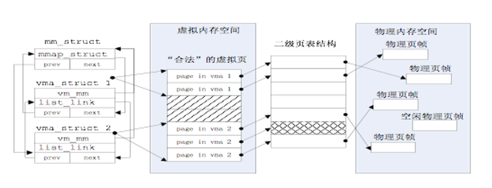
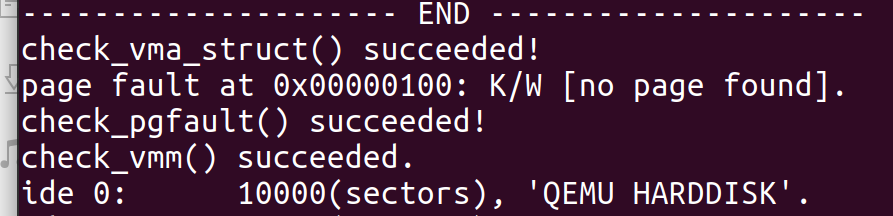
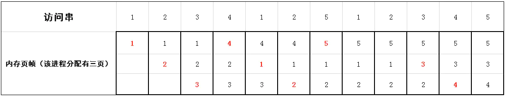
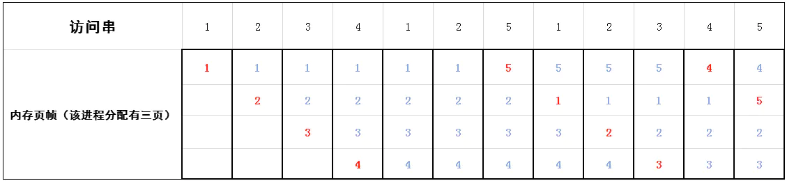
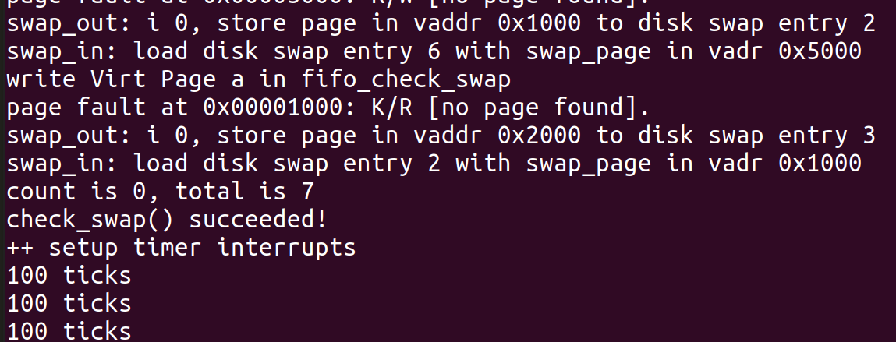
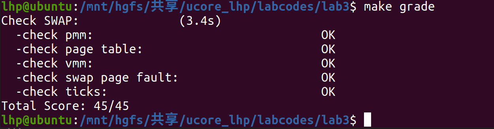

# ucore_lab2
201907040101  刘昊鹏  

- [练习0](#练习0)
- [练习1](#练习1)  
- [练习2](#练习2)   
- [扩展练习](#扩展练习) 
- [总结](#总结)
    - [知识点](#知识点)
    - [思考](#思考)

## 练习0
>__填写已有实验__  
>>本实验依赖实验1。请把你做的实验1的代码填入本实验中代码中有“LAB1”的注释相应部分。提示：可采用diff和patch工具进行半自动的合并（merge），也可用一些图形化的比较/merge工具来手动合并，比如meld，eclipse中的diff/merge工具，understand中的diff/merge工具等。  

使用`WinMerge`完成。

## 练习1
>__给未被映射的地址映射上物理页（需要编程）__   
>>完成do_pgfault（mm/vmm.c）函数，给未被映射的地址映射上物理页。设置访问权限 的时候需要参考页面所在 VMA 的权限，同时需要注意映射物理页时需要操作内存控制 结构所指定的页表，而不是内核的页表。  

实验开始前，先了解两个新的数据结构。
### 数据结构
虚拟地址空间和物理地址空间对应如图：
<div align="center">

</div>

由一个mm_struct管理若干个vma_struct，每个vma_struct对应若干个连续的位于同一个页目录上的虚拟页，每一个虚拟页可根据二级页表对应为物理页。   
1. vma_struct   
定义如下：
```C
struct vma_struct {
    // the set of vma using the same PDT
    struct mm_struct *vm_mm;
    uintptr_t vm_start; // start addr of vma
    uintptr_t vm_end; // end addr of vma
    uint32_t vm_flags; // flags of vma
    //linear list link which sorted by start addr of vma
    list_entry_t list_link;
};
```
vm_start和vm_end描述了一个连续地址的虚拟内存空间的起始位置和结束位置，这两个值都应该是PGSIZE 对齐的，而且描述的是一个合理的地址空间范围（即严格确保 vm_start < vm_end的关系）；list_link是一个双向链表，按照从小到大的顺序把一系列用vma_struct表示的虚拟内存空间链接起来，并且还要求这些链起来的vma_struct应该是不相交的，即vma之间的地址空间无交集；vm_flags表示了这个虚拟内存空间的属性，目前的属性包括：
```C
#define VM_READ 0x00000001 //只读
#define VM_WRITE 0x00000002 //可读写
#define VM_EXEC 0x00000004 //可执行
```
vm_mm指向管理该vma的mm_struct结构体。  
2. mm_struct  
定义如下：
```C
struct mm_struct {
    // linear list link which sorted by start addr of vma
    list_entry_t mmap_list;
    // current accessed vma, used for speed purpose
    struct vma_struct *mmap_cache;
    pde_t *pgdir; // the PDT of these vma
    int map_count; // the count of these vma
    void *sm_priv; // the private data for swap manager
};
```
mmap_list是双向链表头，链接了所有属于同一页目录表的虚拟内存空间，做为vma链表的表头。mmap_cache是指向当前正在使用的虚拟内存空间，由于操作系统执行的“局部性”原理，当前正在用到的虚拟内存空间在接下来的操作中可能还会用到，这时就不需要查链表，而是直接使用此指针就可找到下一次要用到的虚拟内存空间。由于mmap_cache 的引入，可使得mm_struct数据结构的查询加速30%以上。pgdir 所指向的就是mm_struct数据结构所维护的页表。通过访问pgdir可以查找某虚拟地址对应的页表项是否存在以及页表项的属性等。map_count记录mmap_list里面链接的vma_struct的个数。sm_priv指向用来链接记录页访问情况的链表头，这建立了mm_struct和后续要讲到的swap_manager之间的联系。  

<a name = "pagef"></a>  
### Page Fault异常处理
当启动分页机制以后，如果一条指令或数据的虚拟地址所对应的物理页框不在内存中或者访问的类型有错误（比如写一个只读页或用户态程序访问内核态的数据等），就会发生页访问异常。产生页访问异常的原因主要有：
<ul><ul>
<li>目标页帧不存在（页表项全为0，即该线性地址与物理地址尚未建立映射或者已经撤销)；</li>
<li>相应的物理页帧不在内存中（页表项非空，但Present标志位=0，比如在swap分区或磁盘文件上)；</li>
<li>不满足访问权限(此时页表项P标志=1，但低权限的程序试图访问高权限的地址空间，或者有程序试图写只读页面).</li>
</ul></ul>
当出现上面情况之一，那么就会产生页面page fault异常。CPU会把产生异常的线性地址存储在CR2中，并且把表示页访问异常类型的值（简称页访问异常错误码，errorCode）保存在中断栈中。
do_pgfault就是主要的处理Page Fault异常的函数。  

### 代码
首先查看do_pgfault已有的代码：
```C
int
do_pgfault(struct mm_struct *mm, uint32_t error_code, uintptr_t addr) {
    int ret = -E_INVAL;
    //try to find a vma which include addr
    struct vma_struct *vma = find_vma(mm, addr);

    pgfault_num++;
    //If the addr is in the range of a mm's vma?
    if (vma == NULL || vma->vm_start > addr) {
        cprintf("not valid addr %x, and  can not find it in vma\n", addr);
        goto failed;
    }
    //check the error_code
    switch (error_code & 3) {
    default:
            /* error code flag : default is 3 ( W/R=1, P=1): write, present */
    case 2: /* error code flag : (W/R=1, P=0): write, not present */
        if (!(vma->vm_flags & VM_WRITE)) {
            cprintf("do_pgfault failed: error code flag = write AND not present, but the addr's vma cannot write\n");
            goto failed;
        }
        break;
    case 1: /* error code flag : (W/R=0, P=1): read, present */
        cprintf("do_pgfault failed: error code flag = read AND present\n");
        goto failed;
    case 0: /* error code flag : (W/R=0, P=0): read, not present */
        if (!(vma->vm_flags & (VM_READ | VM_EXEC))) {
            cprintf("do_pgfault failed: error code flag = read AND not present, but the addr's vma cannot read or exec\n");
            goto failed;
        }
    }
    /* IF (write an existed addr ) OR
     *    (write an non_existed addr && addr is writable) OR
     *    (read  an non_existed addr && addr is readable)
     * THEN
     *    continue process
     */
    uint32_t perm = PTE_U;
    if (vma->vm_flags & VM_WRITE) {
        perm |= PTE_W;
    }
    addr = ROUNDDOWN(addr, PGSIZE);

    ret = -E_NO_MEM;

    pte_t *ptep=NULL;
```
以上代码作用为排除写一个可写但是不存在的虚拟页、读一个存在的虚拟页、读一个不存在的虚拟页的错误，接下来需要添加给未被映射的地址映射上物理页的代码，上方代码已经准备好页表项需要的权限，我们需要先查找当前虚拟地址对应的页表项，然后给它分配一个物理页，实现如下：
```C
    //查找当前虚拟地址所对应的页表项
    if((ptep = get_pte(mm->pgdir, addr, 1)) == NULL) 
    {
        cprintf("get_pte in do_pgfault failed\n");
        goto failed;
    }
    //如果这个页表项所对应的物理页不存在，则
    if (*ptep == 0) 
    {
        //分配一块物理页，并设置页表项
        if(pgdir_alloc_page(mm->pgdir, addr, perm) == NULL) 
        {
            cprintf("pgdir_alloc_page in do_pgfault failed\n");
            goto failed;
        }
    }
```
测试：
<div align="center">

</div>

### 思考题
- 请描述页目录项（Page Directory Entry）和页表项（Page Table Entry）中组成部分对ucore实现页替换算法的潜在用处。  

     答：目录项和页表项的组成见[实验二中的练习2](https://github.com/lhpqaq/ucore_lhp/blob/master/reports/ucore_lab2.md#%E7%BB%83%E4%B9%A02)的思考题1，可见目录项和页表项都预留了三位的Available给操作系统使用，可用于配合实现页替换算法。

- 如果ucore的缺页服务例程在执行过程中访问内存，出现了页访问异常，请问硬件要做哪些事情？

     答：会产生页面page fault异常。CPU会把产生异常的线性地址存储在CR2中，并且把表示页访问异常类型的值（简称页访问异常错误码，errorCode）保存在中断栈中。然后根据`trap–> trap_dispatch–>pgfault_handler–>do_pgfault`调用顺序处理异常。 

## 练习2
>__补充完成基于FIFO的页面替换算法（需要编程）__  
>>完成vmm.c中的do_pgfault函数，并且在实现FIFO算法的swap_fifo.c中完成map_swappable和swap_out_victim函数。  

do_pgfault中的代码目前并不完整，还缺少对于页表项对应的物理页存在，但位于磁盘上的情况的处理。处理步骤如下：  
1. 调用`swap_in`将物理页从磁盘中载入内存；
2. 调用`page_insert`建立物理地址与线性地址之间的映射；
3. 设置页对应的虚拟地址，方便交换出内存时将正确的内存数据保存在正确的磁盘位置；
4. 调用`swap_map_swappable`将物理页框加入`FIFO`。
据此补充代码：  
```C
    else { //物理页存在，但不在内存中
        if(swap_init_ok) { //swap_init已完成
            struct Page *page=NULL;//根据 mm 结构和 addr 地址，尝试将硬盘中的内容换入至 page 中
            if ((ret = swap_in(mm, addr, &page)) != 0) {//分配一个内存页
                cprintf("swap_in in do_pgfault failed\n");
                goto failed;
            }    
            page_insert(mm->pgdir, page, addr, perm);//建立虚拟地址和物理地址之间的对应关系
            swap_map_swappable(mm, addr, page, 1);//将此页面设置为可交换的
            page->pra_vaddr = addr;
        }
        else {
            cprintf("no swap_init_ok but ptep is %x, failed\n",*ptep);
            goto failed;
        }
   }
```
接下来要完成页替换算法。  

<a name = "FIFO"></a>   
### FIFO页替换算法
该算法总是淘汰最先进入内存的页，即选择在内存中驻留时间最久的页予以淘汰。只需把一个应用程序在执行过程中已调入内存的页按先后次序链接成一个队列，队列头指向内存中驻留时间最久的页，队列尾指向最近被调入内存的页。这样需要淘汰页时，从队列头很容易查找到需要淘汰的页。FIFO算法只是在应用程序按线性顺序访问地址空间时效果才好，否则效率不高。因为那些常被访问的页，往往在内存中也停留得最久，结果它们因变“老”而不得不被置换出去。FIFO算法的另一个缺点是，它有一种异常现象（Belady现象），即在增加放置页的页帧的情况下，反而使页访问异常次数增多。   

<a name = "Belady"></a> 
#### Belady现象
如果对一个进程未分配它所要求的全部页面，有时就会出现分配的页面数增多但缺页率反而提高的异常现象。  
如下示例：  

<div align="center">

</div>

红色标识出的是发生缺页故障后调入的页，可以看见共发生9次缺页异常，而从访问串可知访问12次，所以缺页率为`9/12=0.75`。  
在上述3页帧的基础上多分配一页帧，也就是变成四页帧，则仿照上述分析过程，可画出如下图表
<div align="center">

</div>

可以看见共发生10次缺页异常，而从访问串可知访问12次，所以缺页率为`10/12=0.833`。  
FIFO替换算法产生该现象的原因是它 __没有考虑到程序执行的动态特征__。  

### 代码
page结构体新增了两个成员：
```C
struct Page {  
……   
list_entry_t pra_page_link;   
uintptr_t pra_vaddr;   
};
```
pra_page_link用于构造按页的第一次访问时间进行排序的一个链表，这个链表的开始表示第一次访问时间最近的页，链表结尾表示第一次访问时间最远的页。链表头为定义在swap_fifo.c中的pra_list_head。pra_vaddr用来记录此物理页对应的虚拟页起始地址。  
因此我们可以根据这个链表实现内存页的换入换出。   
在页替换算法框架与其指向如下：
```C
struct swap_manager  
{  
    const char *name;  
    /* Global initialization for the swap manager */  
    int (*init) (void);  
    /* Initialize the priv data inside mm_struct */  
    int (*init_mm) (struct mm_struct *mm);  
    /* Called when tick interrupt occured */  
    int (*tick_event) (struct mm_struct *mm);  
    /* Called when map a swappable page into the mm_struct */  
    int (*map_swappable) (struct mm_struct *mm, uintptr_t addr, struct Page *page, int swap_in);   
    /* When a page is marked as shared, this routine is called to delete the addr entry from the swap manager */
    int (*set_unswappable) (struct mm_struct *mm, uintptr_t addr);  
    /* Try to swap out a page, return then victim */  
    int (*swap_out_victim) (struct mm_struct *mm, struct Page *ptr_page, int in_tick);  
    /* check the page relpacement algorithm */  
    int (*check\_swap)(void);   
};

struct swap_manager swap_manager_fifo =
{
     .name            = "fifo swap manager",
     .init            = &_fifo_init,
     .init_mm         = &_fifo_init_mm,
     .tick_event      = &_fifo_tick_event,
     .map_swappable   = &_fifo_map_swappable,
     .set_unswappable = &_fifo_set_unswappable,
     .swap_out_victim = &_fifo_swap_out_victim,
     .check_swap      = &_fifo_check_swap,
};
```
这里关键的两个函数指针是map_swappable和swap_out_vistim，指向的是_fifo_map_swappable和_fifo_swap_out_victim函数。前一个函数用于记录页访问情况相关属性，后一个函数用于挑选需要换出的页。需要完成的就是这两个函数。  
首先是_fifo_map_swappable，
```C
static int
_fifo_map_swappable(struct mm_struct *mm, uintptr_t addr, struct Page *page, int swap_in)
{
    list_entry_t *head=(list_entry_t*) mm->sm_priv;
    list_entry_t *entry=&(page->pra_page_link);
 
    assert(entry != NULL && head != NULL);
    //record the page access situlation
    /*LAB3 EXERCISE 2: YOUR CODE*/ 
    //(1)link the most recent arrival page at the back of the pra_list_head qeueue.
    return 0;
}
```
根据前面的介绍，只需要将最近被用到的页面添加到算法所维护的次序队列的尾部，即添加
```C
    list_add(head, entry);//将最近用到的页面添加到次序的队尾。
 ```

\_fifo_swap_out_victim基于FIFO算法挑选需要换出的页，由于最近使用的页面在队列尾部，所以需要换出的页面位于队列的头部，只需删除头部的页面，并返回其地址。
```C     
static int
_fifo_swap_out_victim(struct mm_struct *mm, struct Page ** ptr_page, int in_tick)
{
    list_entry_t *head=(list_entry_t*) mm->sm_priv;
    assert(head != NULL);
    assert(in_tick==0);
    /* Select the victim */
    /*LAB3 EXERCISE 2: YOUR CODE*/ 
    //(1)  unlink the  earliest arrival page in front of pra_list_head qeueue
    //(2)  assign the value of *ptr_page to the addr of this page
    list_entry_t *le = head->prev;//指出需要被换出的页
    assert(head!=le);
    struct Page *p = le2page(le, pra_page_link);//根据链表节点成员找到页结构体
    list_del(le);//将进来最早的页面从队列中删除
    assert(p !=NULL);
    *ptr_page = p;//将这一页的地址存储在ptr_page中
    return 0;
}
```
测试结果：
<div align="center">


</div>

### 思考题
- 如果要在ucore上实现"extended clock页替换算法"请给你的设计方案，现有的swap_manager框架是否足以支持在ucore中实现此算法？如果是，请给你的设计方案。如果不是，请给出你的新的扩展和基此扩展的设计方案。  

    答：可以支持实现该算法，实现方法见[扩展练习1](#扩展练习1)。
- 并需要回答如下问题
    - 需要被换出的页的特征是什么？  
        - 该物理页在当前指针上一次扫过之前没有被访问过
        - 该物理页的内容与其在外存中保存的数据是一致的（即没有被修改过） 
    - 在ucore中如何判断具有这样特征的页？  
    相关的PTE位及其释义：  
        - Present: 表示当前PTE所指向的物理页面是否驻留在内存中
        - Accessed: 表示该页是否已被访问过
        - Dirty: 表示该页是否已被修改   

    在ucore中分别表示为PTE_P,PTE_A,PTE_D。  
    需要被换出的页为未被修改，未被访问的页，即PTE_D和PTE_A都是0。 
    - 何时进行换入和换出操作？  
    当需要使用的页不在页表中，且页表已满时，进行换入换出操作。  

## 扩展练习
>__实现识别dirty bit的 extended clock页替换算法（需要编程）__   

<a name = "clock"></a> 
### 时钟（Clock）页替换算法
时钟页替换算法把各个页面组织成环形链表的形式，类似于一个钟的表面。然后把一个指针指向最老的那个页面，即最先进来的那个页面。另外在页表项中设置一位访问位来表示此页表项对应的页当前是否被访问过。当该页被访问时，CPU中的MMU硬件将把访问位置“1”。当操作系统需要淘汰页时，对当前指针指向的页所对应的页表项进行查询，**如果访问位为“0”，则淘汰该页，如果该页被写过，则还要把它换出到硬盘上；如果访问位为“1”，则将该页表项的此位置“0”，继续访问下一个页。**该算法近似地体现了LRU的思想，且易于实现，开销少，需要硬件支持来设置访问位。时钟页替换算法在本质上与FIFO算法是类似的，不同之处是在时钟页替换算法中跳过了访问位为1的页。  

<a name = "enclock"></a> 
#### 改进的时钟（Enhanced Clock）页替换算法
算法淘汰一个页面时只考虑了页面是否被访问过，但在实际情况中，还应考虑被淘汰的页面是否被修改过。因为淘汰修改过的页面还需要写回硬盘，使得其置换代价大于未修改过的页面，所以优先淘汰没有修改的页，减少磁盘操作次数。所以有改进的时钟页替换算法。  

改进的时钟页替换算法：为每一页的对应页表项内容中增加一位引用位和一位修改位。**当该页被访问时，CPU中的MMU硬件将把访问位置“1”。当该页被“写”时，CPU中的MMU硬件将把修改位置“1”。**这样这两位就存在四种可能的组合情况：**（0，0）表示最近未被引用也未被修改，首先选择此页淘汰；（0，1）最近未被使用，但被修改，其次选择；（1，0）最近使用而未修改，再次选择；（1，1）最近使用且修改，最后选择。**  
>页面替换的顺序：  
>1. 从指针当前的位置开始寻找主存中满足(使用位，修改位)为(0,0)的页面；
>2. 如果第1步没有找到满足条件的，接着寻找状态为(0,1)页面；
>3. 如果依然没有找到，指针回到最初的位置，将集合中所有页面的使用位设置成0。重复第1步，并且如果有必要，重复第2步，这样一定可以找到将要替换的页面。

该算法与时钟算法相比，可进一步减少磁盘的I/O操作次数，但为了查找到一个尽可能适合淘汰的页面，可能需要经过多次扫描，增加了算法本身的执行开销。

<a name = "exclock"></a> 
#### 识别dirty bit的extended clock页替换算法
extended与Enhanced两个单词不一样，所以应该不是要写改进的时钟页替换算法，我没有搜索到什么是`识别dirty bit的extended clock页替换算法`算法，个人理解是将一般的页替换算法的标记位认定为dirty位，所以算法思想为：如果dirty位为“0”，则淘汰该页，把它换出到硬盘上；如果dirty为“1”，则将该页表项的此位置“0”，继续访问下一个页。  
代码如下：
```C
static int
_extend_clock_swap_out_victim(struct mm_struct *mm, struct Page ** ptr_page, int in_tick)
{
    list_entry_t *head=(list_entry_t*) mm->sm_priv;
        assert(head != NULL);
    assert(in_tick==0);

    //第一次如果dirty bit为1，改为0，如果为0，则标记为换出页
    //第二次一定能找到换出页
    for(int i = 0; i < 2; i++)
    {
        list_entry_t *le = head->prev;
        assert(head != le);
        // 查找最先进入 && 未被修改 的页面
        while (le != head)
        {
            //获取页表项
            struct Page *p = le2page(le, pra_page_link);
            pte_t *ptep = get_pte(mm->pgdir, p->pra_vaddr, 0);
            // 判断页表项 是否合法
            if (*ptep < 0x1000)     break;
            
            if ((*ptep & PTE_D) == 1)
            {
                //如果dirty bit为1，改为0
                *ptep &= ~PTE_D;
            }
            else
            {
                //如果dirty bit为0，则标记为换出页
                list_del(le);
                assert(p != NULL);
                *ptr_page = p;      //存入ptr_page
                return 0;
            }
            le = le->prev;
        }
    }
    //正常情况下不可能会执行到此处，return -1
    return -1;
}
```
或者去掉for循环，在遍历依次后如果没有找到换出的页，则强制替换最前面的页，效果与上方代码是等价的，并且效率更高，但是上面的代码比较直观。  
修改框架进行测试：
```C
struct swap_manager swap_manager_fifo =
{
    .name = "fifo swap manager",
    .init = &_fifo_init,
    .init_mm = &_fifo_init_mm,
    .tick_event = &_fifo_tick_event,
    .map_swappable = &_fifo_map_swappable,
    .set_unswappable = &_fifo_set_unswappable,
    //.swap_out_victim = &_fifo_swap_out_victim,
    //.check_swap = &_fifo_check_swap,
    .swap_out_victim = &_extend_clock_swap_out_victim,
    .check_swap = &_extend_clock_check_swap,     
};
```
测试结果：
```
-------------------- BEGIN --------------------
PDE(0e0) c0000000-f8000000 38000000 urw
  |-- PTE(38000) c0000000-f8000000 38000000 -rw
PDE(001) fac00000-fb000000 00400000 -rw
  |-- PTE(000e0) faf00000-fafe0000 000e0000 urw
  |-- PTE(00001) fafeb000-fafec000 00001000 -rw
--------------------- END ---------------------
check_vma_struct() succeeded!
page fault at 0x00000100: K/W [no page found].
check_pgfault() succeeded!
check_vmm() succeeded.
ide 0:      10000(sectors), 'QEMU HARDDISK'.
ide 1:     262144(sectors), 'QEMU HARDDISK'.
SWAP: manager = fifo swap manager
BEGIN check_swap: count 1, total 31960
setup Page Table for vaddr 0X1000, so alloc a page
setup Page Table vaddr 0~4MB OVER!
set up init env for check_swap begin!
page fault at 0x00001000: K/W [no page found].
page fault at 0x00002000: K/W [no page found].
page fault at 0x00003000: K/W [no page found].
page fault at 0x00004000: K/W [no page found].
set up init env for check_swap over!
write Virt Page c in clock_check_swap
write Virt Page a in clock_check_swap
write Virt Page d in clock_check_swap
write Virt Page b in clock_check_swap
write Virt Page e in clock_check_swap
page fault at 0x00005000: K/W [no page found].
swap_out: i 0, store page in vaddr 0x1000 to disk swap entry 2
write Virt Page b in clock_check_swap
write Virt Page a in clock_check_swap
page fault at 0x00001000: K/W [no page found].
swap_out: i 0, store page in vaddr 0x2000 to disk swap entry 3
swap_in: load disk swap entry 2 with swap_page in vadr 0x1000
write Virt Page b in clock_check_swap
page fault at 0x00002000: K/W [no page found].
swap_out: i 0, store page in vaddr 0x3000 to disk swap entry 4
swap_in: load disk swap entry 3 with swap_page in vadr 0x2000
write Virt Page c in clock_check_swap
page fault at 0x00003000: K/W [no page found].
swap_out: i 0, store page in vaddr 0x4000 to disk swap entry 5
swap_in: load disk swap entry 4 with swap_page in vadr 0x3000
write Virt Page d in clock_check_swap
page fault at 0x00004000: K/W [no page found].
swap_out: i 0, store page in vaddr 0x5000 to disk swap entry 6
swap_in: load disk swap entry 5 with swap_page in vadr 0x4000
write Virt Page e in clock_check_swap
page fault at 0x00005000: K/W [no page found].
swap_out: i 0, store page in vaddr 0x1000 to disk swap entry 2
swap_in: load disk swap entry 6 with swap_page in vadr 0x5000
write Virt Page a in clock_check_swap
page fault at 0x00001000: K/R [no page found].
swap_out: i 0, store page in vaddr 0x2000 to disk swap entry 3
swap_in: load disk swap entry 2 with swap_page in vadr 0x1000
count is 0, total is 7
check_swap() succeeded!
```

## 总结

### 知识点
部分知识点已经在练习题中给出详细讲解，这里给出目录，可点击跳转。  
- [虚拟页的数据结构](#数据结构)  
- <a href="#pagef">Page Fault异常处理</a>  
- <a href="#FIFO">FIFO页替换算法</a>    
    - <a href="#Belady">Belady现象</a>    
- <a href="#clock">时钟（Clock）页替换算法</a>   
    - <a href="#enclock">改进的时钟（Enhanced Clock）页替换算法</a>   
    - <a href="#exclock">识别dirty bit的extended clock页替换算法</a>   


### 思考
